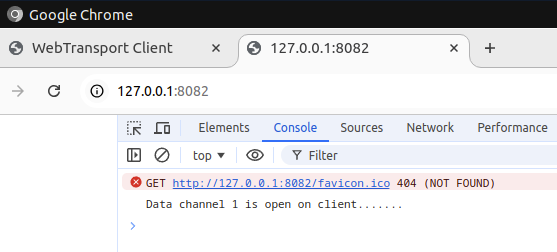
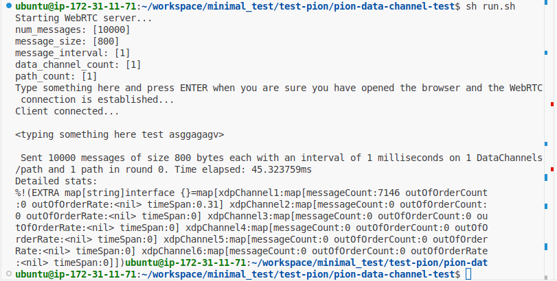

# pion-data-channel-test

This repository is meant for testing the performance of WebRTC data channel on Pion library.

How to run the test:
- Go to the repo's root directory and build the testing server with `go build -o server`
- Run test server using things such as `./server -data_channel_count 1 -experiment_count 1 -message_interval 1 -message_size 800 -num_messages 10000 -path_count 1 -use_wss 0 -use_interface_filter 0` - you can modify the parameters as you like
- Alternatively, run script is available on `sh run.sh` which does the 2 steps above
- Go to browser_client folder and run the test client `python3 app.py` on different terminal
- Open a browser (we tested with Chrome). It won't show anything, but the browser's console should output something like this if the connection is established

- Lastly, you may need to type something (anything) on the first terminal (which runs server) and press ENTER. The performance statistics will show afterwards on that terminal, which should look like this

- On our test shown above, when we send 10,000 messages, sized 800 bytes, every 1ms from server to client, client only receives 7,146 messages out of the 10,000 messages that were sent.